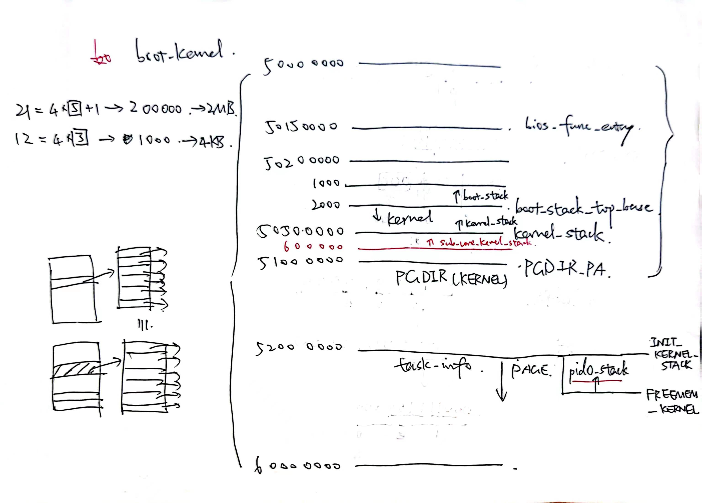

# Project 4 内存管理

## 实验任务

本实验包括六个任务。

具体如下：

- 任务1：启用虚存机制进入内核（C,A,S-core）
- 任务1续：执行用户程序（C,A,S-core）
- 任务2：动态页表和按需调页（C,A-core）
- 任务3：换页机制和页替换算法（C,A-core）
- 任务4：多线程的mailbox收发测试（C,A-core）
- 任务5：多进程共享内存与进程通信（C-core）
- 任务6：copy-on-write策略的实现与在Snapshot技术下的验证（C-core）

## 运行说明

```sh
make all        # 编译，制作镜像
make run        # 启动QEMU，模拟运行
make run-smp    # 启动QEMU，模拟双核运行
# 进一步上板测试
make floppy     # 将镜像写入SD卡
make minicom    # 监视串口
```

进入BBL界面后，输入`loadboot`命令来启动单核。输入`loadbootm`命令来启动双核。

### 测试缺页和按需调页

测试命令为：
```
exec p4
```

将执行`bat/p4.txt`，包含以下子任务：

```
# bat/p4.txt
lock 6 &
lock 7 &
lock 8 &
lock 9 &
fly &
p4_rw
```

其中，`bat/p4_rw.txt`包含以下任务：

```
rw 0x10800000 0x80200000 0xa0000320 &
```

单核上的执行结果示例如下：

```
qemu-system-riscv64: clint: invalid write: 00000004                 
                                                                    
  0x10800000, 188996636                                             
0x80200000, 1970659319                                              
0xa0000320, 337397302                                               
Success!                                                            
> [TASK] Applying for a lock.                                       
> [TASK] Has acquired lock and running.(1)                          
> [TASK] Applying for a lock.                                       
> [TASK] Applying for a lock.                                       
                            _               
                          -=\`\             
                      |\ ____\_\__          
                    -=\c`""""""" "`)        
                       `~~~~~/ /~~`         
                         -==/ /             
                          '-'               
                                                                    
                                                                    
                                                                    
------------------- COMMAND -------------------                     
p4_rw                                                               
===Finish reading!===                                               
                                                                    
                                                                    
===Now excute batch!===                                             
                                                                    
===Reading batch from image...===                                   
rw 0x10800000 0x80200000 0xa0000320 &                               
===Finish reading!===                                               
                                                                    
                                                                    
===Now excute batch!===                                             
===All tasks in batch are excuted!===                               
                                                                    
===All tasks in batch are excuted!===                               
                                                                    
Error: Running a BAT / No such APP / No available PCB!              
> root@UCAS_OS:                                                     
```

### 测试换页机制

测试命令为：
```
exec swap
```

这个用户程序将先向200个页中分别写入0,1,2,...,199，随后依次读出这些页内的值打印在屏幕上。

我们在`include/os/mm.h`中限制了用于用户程序的总页框数`NUM_MAX_PAGEFRAME`为100。由于$100<200$，这将触发页替换机制，因此也由此检验换页机制的正确性。

### 测试多线程管理

测试命令为：
```
exec p4_mbox
```

其中，`bat/p4_mbox.txt`包含以下任务：

```
mailbox a &
mailbox b &
mailbox c &
```

上述测试只测试了`thread_create`函数，而对于`thread_join`与`thread_exit`函数，采用Project 2时编写的`add2.c`测试样例。其测试原理这里不再赘述。

### 测试共享内存

测试命令为：
```
exec consensus
```

### 测试Snapshot技术

测试命令为：
```
exec snapshot
```

共包含两个子测试，第一个测试体现了快照的正确性，第二个测试体现了“两连续快照实际存储的物理地址相同”的特点。

## 设计细节

### 内核地址空间的划分



如上所示：
- 0x50202000开始为内核的代码段以及数据段空间
- 0x50500000为主核在`init/main.c`中使用的栈空间基地址
- 0x50600000为从核在`init/main.c`中使用的栈空间基地址
- 0x51000000开始为供`init/main.c`使用的页表根目录
- 0x52000000开始为供内核动态分配的页资源空间，其中第一个页已被预定为供主核使用的内核栈空间

### 用户页框管理

在`kernel/mm/mm.c`中，我为每个供用户使用的页框资源建立了索引数组。

```c
pf_t pfs[NUM_MAX_PAGEFRAME];
```

数组的每一项对应一个实际的页框。这些页框在kernel初始化时通过`allocPage`函数预分配，并加入了相应的空闲页框链表（free_pf_pool），以供二次分配给用户进程。

pf_t结构体中记录了该页框的所有者（owner，owner_pcb），该所有者视角下的虚拟地址（va），以及实际物理地址对应的kernel虚拟地址（kva）。这里的kva在kernel初始化时给定，之后永不变化。

由此我封装了一个分配页框的函数`alloc_page_from_pool`，用以区分原始的`allocPage`函数。两者的区别在于：
- `alloc_page_from_pool`函数从空闲页框链表中分配页资源，通过它分配的页是可以被回收（以及被swap替换出内存）的
- `allocPage`函数直接从内存分配页资源，通过它分配的页是不可被回收的

那么，有可能你会好奇，既然有了`alloc_page_from_pool`，我们为什么还需要`allocPage`呢？原因有以下三点：
- `alloc_page_from_pool`的实现基于`allocPage`
- 相邻两次`alloc_page_from_pool`分配的页资源在物理空间中是不保证连续的，而`allocPage`可以一次性分配多个连续的页
- `kmalloc`函数需要分配任意大小的空间，因此它的实现基于`allocPage`所保障的物理空间连续性

值得注意的是，由于用户程序`shell`在运行bat嵌套bat的task时，内核栈若只开一个页将会导致栈溢出。由于尚未实现内核态内核栈缺页的处理机制，因此我们需要为`shell`进程预先分配两个物理空间连续的页，以保证内核栈不会发生缺页。这里内核栈的连续性也通过`allocPage`函数保证，而非`alloc_page_from_pool`实现。

为用户进程的用户栈与页表分配页资源时，使用了可回收的`alloc_page_from_pool`函数；为内核栈分配页资源时，使用了不可回收的`allocPage`函数。

用户进程的用户栈与页表占用的页框记录在PCB内`pf_list`这个链表中。当程序退出时，位于`pf_list`中的页框将被回收，重新加入`free_pf_pool`链表。

内核栈资源与PCB相绑定，仅在初次使用该PCB时通过`allocPage`分配。在进程退出、PCB被复用时，内核栈被一并复用。这是通过恢复内核栈当前地址到其基地址来实现的。

### swap区管理

在`kernel/mm/mm.c`中，我按和页框一样的逻辑，为sd卡中swap区的空间建立了索引数组。

```c
swp_t swps[NUM_MAX_SWAPPAGE];
```

索引数组在kernel初始化时被初始化，所有空闲swap空间组成了一个空闲swap链表（free_swp_pool）。

swp_t结构体中记录了该swap空间的所有者（owner），该所有者视角下的虚拟地址（va），以及在sd卡中的位置（block_id）。这里的block_id在kernel初始化时给定，之后永不变化。

为了便于debug，和页框一样，我在PCB中记录了对应进程的所有被换出内存的页所在swap空间的索引链表（swp_list）。该链表内的swap空间在进程退出时将和`pf_list`一样被释放。

#### swap替换策略
在内存页框资源紧张时，将选择一个幸运的页框`swap_out`到sd卡。这里的替换策略是随机选择一个页框，查看该页框是否可替换（约定va项为0表示该页框不可被替换；不可被替换的页框主要为各用户进程的各级页表所在页），并按页框在索引数组内的下标向后搜索直至遇到一个可被替换的页框。

从`free_swp_pool`中pop出一个可用swap空间。将这个幸运的页框写入该swap空间，并将该页框索引从对应PCB中的`pf_list`挪动到`free_pf_pool`，将该swap空间索引加入到对应PCB中的`swp_list`。

#### 缺页处理机制

当发生缺页时，将首先检查对应PCB中的`swp_list`，判断发生缺页是否因为该页被换出。并依此进行后续的页换入`swap_in`或者分配新页`alloc_page_helper`。

### 多线程管理

线程机制基本同之前实验，只需注意页表根目录地址的拷贝与栈空间的分配即可。此处不再赘述。

### 共享内存

和之前一样，我为共享内存创建了一个索引数组。

```c
shm_t shms[NUM_MAX_SHMPAGE];
```

shm_t结构体中记录了该内存所在的页框指针（pf），关键字（key），以及占用进程数（handle_num）。

key与handle_num的逻辑见上个Project中的mutex lock。当handle_num为0时，页框将被回收，该索引将被复用。

值得注意的是，共享内存的申请函数`shm_page_get`并未将期望的虚拟地址`va`作为它的参数——这意味着内核需要找块虚拟地址与用户程序约定为共享内存的分配地址。当然用户程序依旧可以使用这块地址，内核应该懂得避开用户已使用的地址。（这也是共享内存测试的一部分）

这里，我将虚拟地址的0x10000000-0x1fffffff空间作为了共享内存的地址范围。

```c
#define SHMPAGE_VA_BASE 0x10000000
#define SHMPAGE_VA_SIZE 0x10000000
```

### 快照

快照的实现原理为copy on write，这里不再赘述。

和共享内存部分一样，快照函数`take_snapshot`的输入未指定一个期望的虚拟地址——内核需要自己找块空闲的虚拟地址作为快照的返回地址。当然用户程序依旧可以使用这块地址，因此内核应该懂得避开用户已使用的地址。

这里，我将虚拟地址的0x20000000-0x2fffffff空间作为了快照的地址范围。

```c
#define SNAPSHOT_VA_BASE 0x20000000
#define SNAPSHOT_VA_SIZE 0x10000000
```

## 实验过程

**这里仅记录实验过程中遇到的一小部分问题与思考。**

**讲义上已包括的内容以及前文提及的设计方案不再赘述。**

### `exec`指令传递参数时内核态出现缺页

默认增加的缺页处理机制只能应对用户态出现缺页，但如果使用了`get_kva_of`函数，在内核态是有缺页风险的。这一点在内核调用`exec`函数往用户栈中赋值时得到体现。具体如下：

`exec`函数需要创建一个新的进程。这个过程包含多次对页的分配。但是此时如果剩余页资源紧张，内核需要将已被占用的页换到sd卡来分配新的页。在这一过程中，刚分配的用户栈空间也有可能被换出内存。如果对内核栈的赋值操作在换出内存之后，将导致`get_kva_of`返回值无效。此时需要先将这个用户栈页换回内存，再继续完成后续的修改操作。

除此之外，调用`exec`指令的进程也保存了参数（`argv`指针数组内元素指向的字符串）在它的用户栈空间上。这个用户栈页也有可能被换出内存。这里的解决方法是：先将该部分参数存入kernel的静态内存空间，然后再为新进程分配空间，最后初始化新进程用户栈时从kernel的静态内存空间中搬运参数。

### `load_app_img`时内核态出现缺页

`load_app_img`函数用于完成从sd卡加载image到内存的操作。这个操作往往涉及对多个页的初始化，这些页是一个接着一个分配的。根据我最初设计的逻辑，每个页将首先一次性从sd卡读取8（=4096/512）个块，然后利用`strcpy`函数移动页内数据。（需要移动数据是因为sd卡中image文件内部各个task所在的段并非按块对齐的。）每个页最终的数据来自初始时自身页的页尾与下一个页的页首。

这在task3中遇到了bug。经过漫长的debug（该bug查了好久好久~），我发现当内存空闲页空间不多时，这些页有可能未正常初始化！

这是因为，如果`load_app_img`时内存空闲页资源紧张，将会出现先前分配的页尚未完成初始化，便被换出了内存的情况。我们必须一次性读两个页的块数，来确保申请下一个页时，前一个页已经完成了初始化。

于是，在后续的解决方案中，我在内核的静态存储区增加了一个两个页大小的`buff`，用于暂存从`sd`卡中读取的数据。随后，将偏移后的数据搬运到刚分配的页上，从而实现了分配一个页便初始化一个页的机制。

### 系统调用时出现缺页

这个错误在`do_mbox_open`时发现。`do_mbox_open`接收一个`char *name`的参数，为一个指针类型。在整个系统调用过程中，看似不会分发新的页，因此也不应该出现缺页。然而事实上，`do_mbox_open`在传入参数时并未保证该参数指向的地址是有效的。有可能该地址指向的数据已经被换出了内存，但是由于传入参数时只需传入地址的值，因此也不涉及到对缺页的检查。因此，一种更为合理的做法是：在系统调用内实际使用到传入的地址参数时，增设检查该页是否有效。

**由于该bug需要修改几乎所有系统调用的逻辑（包括驱动文件）（甚至意味着对于`strcpy`这类函数，每读若干值需要check一次），考虑到这种情况仅会在页资源及其紧张的情况下出现（例如只开10个页框给所有用户进程），因此不做修复。**
